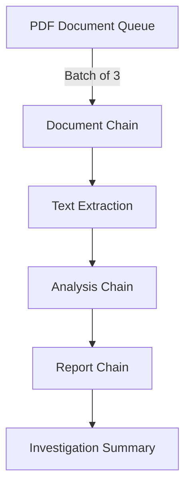

# JFK Document Analysis with LangChain

## Overview

This document outlines the architecture of our LangChain-based investigative agent system for analyzing the JFK document collection. The system uses chains and agents to process and analyze declassified JFK documents while maintaining the perspective of an unbiased investigator who is discovering the information for the first time.

## System Architecture

### 1. Document Processing Chain



### 2. Core Components

#### 2.1 Document Queue Manager
- Maintains a queue of PDF documents from the National Archives
- Processes documents in batches of 3 for efficient analysis
- Tracks processed documents to avoid duplication

#### 2.2 Investigative Agent
- Uses LangChain's agent framework for reasoning
- Maintains an unbiased investigative perspective
- Analyzes documents without prior knowledge of JFK case
- Uses OpenRouter API for LLM processing

```python
from langchain.agents import initialize_agent, Tool
from langchain.memory import ConversationBufferMemory
from langchain.chat_models import ChatOpenRouter
from langchain.chains import LLMChain
from langchain.prompts import PromptTemplate

class InvestigativeAgent:
    def __init__(self, api_key):
        self.llm = ChatOpenRouter(
            api_key=api_key,
            model="anthropic/claude-3-opus"
        )
        
        self.memory = ConversationBufferMemory(
            memory_key="chat_history",
            return_messages=True
        )
        
        self.tools = [
            Tool(
                name="document_analyzer",
                func=self.analyze_document,
                description="Analyzes a document from an investigative perspective"
            ),
            Tool(
                name="connection_finder",
                func=self.find_connections,
                description="Identifies connections between documents and events"
            ),
            Tool(
                name="report_generator",
                func=self.generate_report,
                description="Generates investigative reports based on findings"
            )
        ]
        
        self.agent = initialize_agent(
            tools=self.tools,
            llm=self.llm,
            agent="chat-conversational-react-description",
            memory=self.memory,
            verbose=True
        )
```

### 3. Chain Components

1. **Document Processing Chain**
   ```python
   document_chain = LLMChain(
       llm=llm,
       prompt=PromptTemplate(
           template="Analyze the following document from an investigative perspective: {document}",
           input_variables=["document"]
       )
   )
   ```

2. **Analysis Chain**
   ```python
   analysis_chain = LLMChain(
       llm=llm,
       prompt=PromptTemplate(
           template="Based on the document analysis, identify key findings and geopolitical implications: {analysis}",
           input_variables=["analysis"]
       )
   )
   ```

3. **Report Chain**
   ```python
   report_chain = LLMChain(
       llm=llm,
       prompt=PromptTemplate(
           template="Generate an investigative report summarizing the findings: {findings}",
           input_variables=["findings"]
       )
   )
   ```

### 4. OpenRouter Integration

```python
from langchain.chat_models import ChatOpenRouter

llm = ChatOpenRouter(
    api_key="your-api-key",
    model="anthropic/claude-3-opus",
    temperature=0.7
)
```

## Implementation Notes

1. **Document Processing**
   - Process documents in groups of 3 using sequential chains
   - Each document goes through the full chain before processing the next
   - Results are aggregated for the final report

2. **Chain Execution**
   - Document chain extracts and preprocesses text
   - Analysis chain identifies key information
   - Report chain compiles findings
   - All chains maintain investigation context through memory

3. **Memory Management**
   - ConversationBufferMemory stores chat history
   - Key findings stored in structured format
   - Cross-document references maintained

4. **Report Structure**
   - Executive summary
   - Document analysis
   - Key findings
   - Geopolitical implications
   - Supporting evidence
   - Areas for further investigation

## Usage

```python
# Initialize the components
investigator = InvestigativeAgent(api_key="your-api-key")

# Process a batch of documents
async def process_batch(pdf_urls):
    findings = []
    for i in range(0, len(pdf_urls), 3):
        batch = pdf_urls[i:i+3]
        
        # Process each document in the batch
        batch_results = []
        for url in batch:
            # Run the document through the chain
            result = await investigator.agent.arun(
                f"Analyze the document at {url} and provide key findings."
            )
            batch_results.append(result)
        
        # Generate batch summary
        batch_summary = await investigator.agent.arun(
            f"Summarize the findings from these documents and identify connections: {batch_results}"
        )
        findings.append(batch_summary)
    
    # Generate final report
    final_report = await investigator.agent.arun(
        f"Generate a comprehensive report based on all findings: {findings}"
    )
    return final_report
```

## Security and Privacy

- API keys stored in environment variables
- Document access logged and tracked
- Sensitive information handled according to guidelines
- Results stored securely

## Dependencies

- LangChain
- OpenRouter API
- PDF processing libraries
- Requests for document fetching
- Python-dotenv for environment variables 